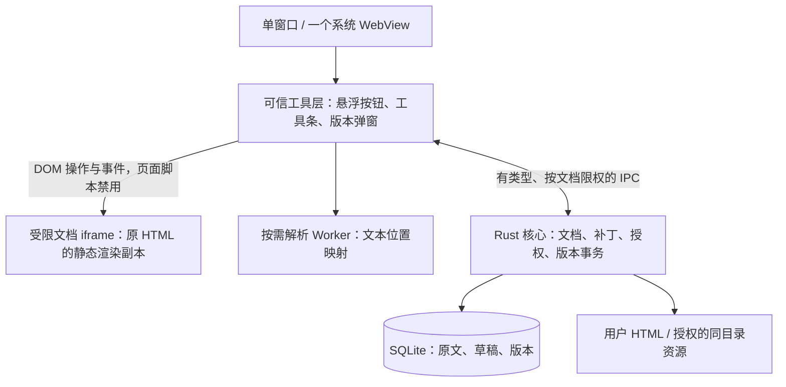

# ADR-001：系统 WebView 驱动的轻量桌面架构

日期：2026-09-17

状态：架构提案；交互已定稿，技术选型待三端原型验证。

适用平台：macOS、Windows、Omarchy（Linux 仅此发行环境）。

这是一款单文件 HTML 文字编辑工具：打开、完整预览、双击改字、保存版本、回退、导出。建议采用 **Tauri 2 + Rust + 原生 TypeScript/DOM + 系统 WebView**。发布物不携带 Chromium、Node.js 或独立服务端。

本 ADR 是第一份软件架构决策，没有被替代的旧 ADR。它取代 [v0.3 设计说明](../html-editor-design.md) 中「示例页面 + localStorage」作为正式软件实现的设想；保留全部已确认交互。后续分别见 [模块与数据契约](architecture-contract.md)、[实施与验收计划](implementation-plan.md)。

## 1. 核心决策

| 部分       | 选型                            | 原因                                                                     |
| ---------- | ------------------------------- | ------------------------------------------------------------------------ |
| 桌面外壳   | Tauri 2，单窗口                 | 复用系统渲染器，提供文件对话框和打包能力                                 |
| 窗口内容   | 一个系统 WebView                | 不为工具条、版本弹窗各建 WebView；HTML iframe 不等同于第二个原生 WebView |
| 工具界面   | TypeScript + 原生 DOM/CSS       | 控件很少，不引入 React、Vue、编辑器框架或组件库                          |
| 页面编辑   | 少量 DOM 事件与文本事务         | 修改文字，不实现通用富文本编辑器                                         |
| 原文解析   | parse5，保留源位置，按需 Worker | 需要 HTML 解析规则和源码定位，不用正则解析 HTML                          |
| 数据与文件 | Rust 核心                       | 文档身份、补丁、版本事务、目录授权、导出由同一层负责                     |
| 版本存储   | SQLite，直接 SQL，无 ORM        | 原文存一份，版本只存文字补丁；支持崩溃恢复与事务                         |
| 构建       | Vite + TypeScript、Cargo        | Node.js 仅用于开发构建，不存在于发布运行时                               |
| 网络服务   | 无 localhost 服务、无云端       | 自定义资源协议提供文档资源，无常驻监听端口                               |

Tauri 官方说明它在运行时调用系统 WebView，而不将 WebView 库放进最终可执行文件。这满足「不把整套浏览器内核塞进软件」的目标。[Tauri 进程模型](https://tauri.app/concept/process-model/)

**不捆绑内核不等于没有渲染器成本。** 系统 WebView 仍会创建 WebContent、GPU、网络等进程，数量由平台和运行时决定。不能把「一个 WebView」宣传成「只有一个进程」，也不能承诺任意 HTML 都只用几十 MB 内存。

## 2. 平台和分发

| 平台             | 实际渲染器              | 建议发布形式                                                        | 用户机器依赖                                                        |
| ---------------- | ----------------------- | ------------------------------------------------------------------- | ------------------------------------------------------------------- |
| macOS            | WKWebView / 系统 WebKit | 分架构签名 `.app` / `.dmg`                                          | 系统提供；先分别构建 arm64 和 x86_64，避免默认 Universal 包增大     |
| Windows          | WebView2                | 每架构安装包，使用 Evergreen                                        | 检测共享 Runtime；缺失时显式引导在线安装，不打包 Fixed Version 内核 |
| Omarchy（Linux） | 系统 WebKitGTK          | Arch 原生 `.pkg.tar.zst`；提供 `PKGBUILD`，可后续发布 AUR `-bin` 包 | 依赖 `webkit2gtk-4.1` 等系统运行库，由包管理器解决；不捆绑内核      |

Windows 11 预装 WebView2 Runtime，多数 Windows 10 设备也已有，但不能省略缺失检测。Evergreen 可由不同应用共享。[Microsoft 分发说明](https://learn.microsoft.com/en-us/microsoft-edge/webview2/concepts/distribution)

Omarchy 首版使用 Arch 原生包，不提供 deb/rpm，也不以 AppImage 为主发布物。AppImage 通过打包依赖换取便携性，会增大文件体积，与当前优先级冲突。Flatpak 也不作为「首次总下载很小」的承诺。[Tauri AppImage 说明](https://v2.tauri.app/distribute/appimage/)

建议验证基线：macOS 13+；Windows 11 x64；Omarchy stable x86_64 的默认 Hyprland / Wayland 会话。Linux 只承诺 Omarchy，不扩展 Debian、Ubuntu、Fedora、GNOME、KDE 或独立 X11 桌面矩阵。Windows ARM 和 Omarchy ARM 后续按需评估。这是产品支持范围建议，不是框架最低系统版本声明。

Omarchy 基于 Arch 与 Hyprland，支持官方包和 AUR。应用提供预构建的 Arch 包，用户安装时无需 Rust、Node 或本地编译；`PKGBUILD` 与依赖清单必须和发布产物一起维护。AUR 是后续分发选项，当前不宣称已进入 Omarchy 或 Arch 官方仓库。[Omarchy 官方介绍](https://omarchy.org/)、[Omarchy 软件包说明](https://learn.omacom.io/2/the-omarchy-manual)

依赖名使用 `webkit2gtk-4.1`，不使用旧 API 4.0。Arch 官方仓库已有该包，但不能假设目标 Omarchy 已预装；在目标 Omarchy 的镜像与系统快照上核对可用版本。缺失时由包管理器安装共享运行库，其首次下载和磁盘成本单独报告。[Arch WebKitGTK 包](https://archlinux.org/packages/extra/x86_64/webkit2gtk-4.1/)

Omarchy 的支持基线记录为：Omarchy 版本 / 更新通道、Hyprland、WebKitGTK、GTK、GPU 驱动与系统包快照。每次发布在一套稳定快照和更新后的 stable 环境验收。重点验证 Wayland 下中文输入法、分数缩放、弹窗焦点、文件选择器和 GPU 渲染；不通过默认禁用 GPU 或强制 XWayland 掩盖问题。

## 3. 架构和职责

可信工具层占满窗口，但自身背景透明、无布局边距。文档 iframe 宽高始终与内容区一致。预览只有右上角编辑按钮；编辑时原位展开工具条。切换模式不重建文档、不调整 iframe 尺寸，保留滚动位置。

软件有三个不同的数据表示：

- **源文件字节**：不可变原始输入，保存和导出的依据。
- **渲染副本**：用于资源路由、静态预览和交互，可以存在临时编辑标记。
- **文本补丁**：用户改过哪些原始文本区间，是版本之间的变化。

渲染副本不具有保存权威。禁止把 `document.documentElement.outerHTML` 序列化后覆盖用户文件。

## 4. 原位修改如何保持轻量

打开时解析一次，建立文本节点与源码位置映射。进入编辑不重新解析整页；鼠标事件委托给文档，每次输入只处理当前文字片段。

parse5 支持源位置信息，但浏览器容错补出的节点可能没有源码位置。因此编辑前必须校验位置、原始文本和 DOM 结构，不能看到文字就认定能安全回写。[parse5 ParserOptions](https://parse5.js.org/interfaces/parse5.ParserOptions.html)

纯文字叶节点优先直接编辑。包含加粗、链接等混合内容的节点，按原始文本片段分隔事务，不允许删除父标签或跨片段合并。输入法、实体、表格容错和混合节点处理是技术原型的必测项；若无法可靠保持结构，该片段只读并提示原因，不静默降级为整块替换。

原位输入在 DOM 本地完成，不把每次按键变成全文件 IPC。文字事务完成后向 Rust 提交文本变化；草稿按空闲时间合并落盘。撤销栈存文字操作，版本列表按需加载，不在内存中存多份完整页面。

## 5. 页面隔离与本地资源

首版针对静态 HTML。用户文件中的脚本保存在原文中，但编辑和预览均不执行；脚本生成页面不承诺完整复原。这样可避免页面脚本抢改正在编辑的 DOM，也减少后台定时器开销。

推荐采用同源 `srcdoc` 文档 iframe，设置 `sandbox="allow-same-origin"`，不给 `allow-scripts`。可信父层直接访问 DOM 并挂接事件；iframe 不运行编辑代理脚本。渲染副本同时禁用脚本、对象、子 frame、表单提交和自动跳转。具体 CSP 与 WebKit/WebView2 行为必须经过三端原型测试。

**不能只依赖 Tauri 的 iframe 权限区分。** 官方说明 Linux 上无法区分嵌入 iframe 与窗口的部分调用来源；因此首版不在不可信文档内开放脚本，也不授予通用文件、Shell 或进程能力。[Tauri Capabilities](https://tauri.app/security/capabilities/)

资源由 Rust 受限协议路由提供，只读取当前用户选择的 HTML 和授权资源目录。路径需规范化、校验符号链接与越界；不允许用 URL 读取任意系统文件。同目录 CSS、图片、字体按需加载，不能为了单个 HTML 扫描或缓存整个目录。

默认离线加载本地资源；远程 CSS、字体和图片是单独的兼容选项，开启后保留浏览器正常缓存机制。无论是否开启远程资源，都不执行原文件脚本。`base`、CSS 相对 URL、字体 CORS、自定义协议导航行为列为原型验收项。

这些约束是源文件的执行策略，不改变导出原文中的脚本和属性。打开导出文件时，其行为仍由文件本身和浏览器决定。

## 6. 版本与保存

SQLite 保存一次原始 HTML，以及基于这份原文的文字补丁版本。每个版本存的是当前全部有效补丁集合，而不是必须从 v1 一直重放到 v1000 的长链。

- 普通保存：在单次事务内插入新版本、更新当前版本指针、清理对应草稿。
- 回退：保留所有旧版本；有草稿时先备份，再生成内容等于目标版本的新版本，两步在同一事务内提交。
- 导出：将版本补丁按原文位置组合为完整 HTML，写临时文件，再完成平台适配的替换或新建。
- 原文件默认保持不动；「保存版本」保存应用内历史，「导出 HTML」生成用户文件，延续定稿交互。
- 外部程序改动原文件时，以文件摘要检测冲突，创建新导入基线或重新打开，不把旧补丁套到新文件上。

正式版本不依赖 localStorage。SQLite 可作为应用私有小型库打包，避免三端系统 SQLite 版本差异；其体积纳入应用预算，不额外启动数据库进程。

## 7. 性能预算：目标，不是实测结果

以下是首轮技术原型的评审门槛。无法达到时先查明瓶颈，再调整设计或明确变更预算，不作为尚未验证的产品宣传。

| 指标              | 初始目标                                | 测量口径                                                                       |
| ----------------- | --------------------------------------- | ------------------------------------------------------------------------------ |
| 应用压缩安装包    | 每架构 ≤ 15 MiB，超 20 MiB 必须复审     | 不包含已安装系统运行库；另报缺失运行库的首次下载和磁盘成本                     |
| 编辑器自有 JS/CSS | gzip 合计 ≤ 300 KiB                     | 含解析器，不含用户 HTML；同时报告未压缩体积                                    |
| 冷启动到可操作    | P95 ≤ 2 秒                              | Release 构建，从进程创建开始；排除首次安全扫描、签名验证与运行库安装并单独报告 |
| 常规文件打开      | P95 ≤ 1 秒                              | 本地 1 MiB HTML、≤10,000 DOM 节点、≤4 MP 静态图片，无网络等待                  |
| 文字输入延迟      | P95 ≤ 50 ms                             | 键入到画面更新，包含中文输入法场景                                             |
| 保存 / 回退       | P95 ≤ 200 ms                            | 常规样本、100 个文本变化，包含事务提交                                         |
| 主进程常驻内存    | ≤ 40 MiB 作为调查线                     | 平台计数器不同，分别报告；不能仅凭该值判断总资源                               |
| 应用相关总内存    | 常规静态样本稳定后 ≤ 180 MiB 作为调查线 | 纳入可归属的 WebContent、GPU、网络进程；标明共享内存口径                       |
| 空闲 CPU          | 60 秒均值 < 单核的 0.5%                 | 无动画、音视频、网络、用户输入的样本                                           |
| 反复开关 / 切换   | 50 次后无持续增长趋势                   | 记录回收后的内存平台值与时间序列                                               |

统一使用 SSD、8 GiB 及以上内存的参考设备：M1 Mac、11 代 i5 Windows 和同级 Linux；每个平台记录精确硬件、系统、WebView 版本。Linux 在 Omarchy 默认 Hyprland / Wayland 会话验收，记录应用实际使用的 GTK 后端；XWayland 仅作为有证据支持的兼容退路，不建立独立 X11 桌面支持矩阵。不同系统的内存指标不直接相加比较，不能重复计入共享页。

默认无托盘驻留、后台常驻服务、启动网络请求、轮询扫描和全量目录监听。最后一个窗口关闭后退出，先完成未保存内容处理。仅保留一个活动文档和一个渲染实例；没有为每个版本创建页面或截图。

## 8. 替代方案

| 方案                             | 评价                                                                                             |
| -------------------------------- | ------------------------------------------------------------------------------------------------ |
| Electron / CEF                   | 自带 Chromium，与明确的分发目标冲突，不采用                                                      |
| 三套原生外壳：AppKit、Win32、GTK | 可能减少外壳依赖，但需维护三套窗口、文件、输入法、打包逻辑；作为 Tauri 原型不达标时的备选        |
| 直接 Wry + Tao                   | 可减少框架功能，但需自行补齐权限、IPC、安装、生命周期；只有测量证明 Tauri 外壳是主要瓶颈时再考虑 |
| 浏览器扩展 / 本地网页            | 安装体积小，但文件授权、独立版本存储和桌面体验变化较大，不作为本次定稿交互的主实现               |
| 自绘 HTML 或轻量富文本渲染器     | 难以还原一般 HTML/CSS，维护成本与兼容风险过高                                                    |

不预先移除有价值的小依赖来换取大量自研代码。先用依赖审计、Release 构建和剖析证明瓶颈，再针对性削减。

## 9. 必须通过的架构验证

1. 三种真实系统 WebView 中，同源禁脚本 iframe 能接受父层原位编辑，且用户脚本、子 frame、自动导航不能获得应用能力。
2. 中文输入法、实体、混合标签、表格和长段落能安全映射；导出仅改变允许的文本区间。
3. Omarchy 的 Arch 原生包能通过包管理器正确解决依赖并启动，且产物没有捆绑内核；Windows 缺失 Runtime 路径不偷偷转为内核打包。
4. 保存、备份、回退与崩溃恢复具备原子性；资源路径不可越界。
5. 在真实系统 WebView 上通过性能预算。普通浏览器或 Playwright 的模拟内核结果不能代替这一门槛。

本轮仅完成设计与官方文档核对，未实现或测量桌面应用。原型验证失败时修订本 ADR，不为维持选型而隐藏兼容性或资源成本。
