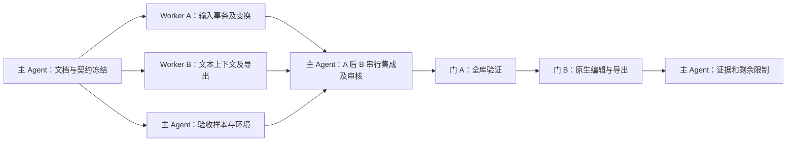

# 编辑正确性修复实施计划

日期：2026-09-26。基线：9af26e59308e94f7dc41a30839d152dc066f1a8d。范围为本次 review 的四项缺陷，不包含之前建议中的全库重构、性能协议改造或发布流程变更。

PR 集成修订（同日）：用户随后明确要求提交 PR。远程 main 已更新至 c42a4c0，包含职责拆分和隔离动态报告。主 Agent 单线负责将修复接入现有 input-surface / main，并适配 live-document 的空节点映射、预览首 LF 和 live-bridge 快照序列化；新增所有权为 src/input-surface.ts、src/live-document.ts、src/live-bridge.ts、tests/live-document.test.ts。原 worker 已交付，不再并行编辑；这是对先前文件所有权与“保持未提交”交付状态的明确修订。ADR 编号调整为 014，保留上游 ADR-010 至 ADR-013。PR 前重新完成全库检查、构建和原生编辑/导出验证。

## 决策、替代与风险

两名 worker 使用独立 worktree 并行修复；主 Agent 维护文档、准备原生验收样本，并在两条工作流完成后串行集成和审核。共享工作区直接并行修改不能提供物理隔离，因此不采用。按文件所有权隔离避免 main.ts 热点冲突；输入事务相关三项缺陷由同一 worker 处理。

worker 以完整 ownership 补丁交付，主 Agent 串行回灌并审核。按用户后续要求，最终结果提交到独立分支并创建 PR；不创建发布或修改已发布标签。

## DAG 与所有权

| 执行者   | ownership                                                                                                                                                                                                                  | 禁止修改                                                              | 定向验收                                                                                   |
| -------- | -------------------------------------------------------------------------------------------------------------------------------------------------------------------------------------------------------------------------- | --------------------------------------------------------------------- | ------------------------------------------------------------------------------------------ |
| Worker A | src/main.ts；新增 src/input-controller.ts、src/input-transaction.ts、src/input-geometry.ts、src/input.css；src/i18n.ts；新增 tests/input-transaction.test.ts、tests/input-geometry.test.ts、tests/input-controller.test.ts | parser、contracts、Rust、依赖、配置、文档，以及所有 B 文件            | typecheck；仅 input-\* 测试；git diff --check                                              |
| Worker B | src/contracts.ts、src/parser.ts、src-tauri/src/document.rs；tests/parser.test.ts；新增 tests/text-context.test.ts 和 tests/fixtures/text-context.json                                                                      | main、输入模块、UI、其他 Rust 模块、依赖、配置、文档，以及所有 A 文件 | typecheck；parser/text-context 测试；仅 document Rust 测试；定向 rustfmt；git diff --check |
| 主 Agent | docs/ADR-014-edit-transaction-fidelity.md、docs/edit-correctness-contract.md、docs/edit-correctness-plan.md、docs/edit-correctness-verification.md、AGENTS.md；artifacts 下的验收材料                                      | worker 运行时不修改其 ownership 文件                                  | 文档格式/链接/空白；集成后的全库检查与原生验收                                             |

同一文件不允许两个执行者同时修改。需要新增所有权外文件时先报告；默认没有跨 worker 边界例外。worker 不触发全量测试/构建或原生桌面操作。文档冻结在主工作区，worker 按主 Agent 提供的绝对路径读取。

## 门禁与交付状态

| 阶段     | 通过条件                                                                                  | 当前状态                 |
| -------- | ----------------------------------------------------------------------------------------- | ------------------------ |
| T0       | 三份文档齐备，字段、职责、文件所有权及验收冻结；格式/链接/空白检查通过                    | 已通过                   |
| 并行修复 | 各 worker 定向检查通过，完整 diff 不越界                                                  | 已通过                   |
| 集成审核 | 主 Agent 逐项核查修复与失败分支；每份补丁集成后 typecheck 通过                            | 已通过                   |
| 门 A     | check、fmt、Clippy、前端与 macOS 原生构建通过；字节保真探针通过                           | 已通过                   |
| 门 B     | 系统 WebView 真实键盘替换/退格、清空重编、Enter/Esc、撤销重做、原生导出；IME 单独记录证据 | 核心流程通过；IME 待验收 |

未通过的检查退回原 owner 修复，不以主 Agent 越界补丁掩盖集成冲突。Windows/Omarchy 无实机证据时保持待验收。最终验证记录列明实际测试数、使用的构建、失败恢复验证方法与无法验证事项。

原始基线集成审核补充发现 `noframes` raw-text 遗漏，已退回 Worker B 补齐同一规则和三组回归。该阶段 12 个源文件与 owner 交付逐字节一致。PR 阶段由主 Agent 按上述扩展所有权接入最新 main；Worker A 只读复审，发现 live-bridge 快照首 LF 丢失后，由主 Agent 修复并补充生产 capture handler 的完整往返测试。详见[验收记录](edit-correctness-verification.md)。
