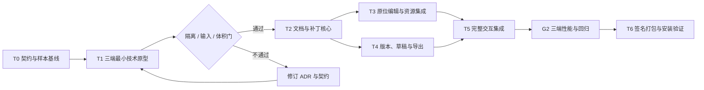

# 实施与验收计划 v0.2

## Base UI 界面批次（2026-09-17）

依赖：T0 文档冻结 → Base UI 外壳与依赖接入 → 编辑引擎状态/动作桥接 → 全库检查 → WKWebView 验收与包体记录。全部文件由主 Agent 串行维护，不设并行波次；热点 `main.ts`、`index.html` 和依赖锁文件保持单一所有者。详细验收见 [ADR-004](ADR-004-base-ui-shell.md)。

采用局部 UI 替换，保持 Rust 与解析器接口；替代的全量引擎重写不属于本批。主要风险为焦点切换丢失未提交输入以及包体增长，分别通过原生编辑/弹窗/导出链路与构建测量验收。

2026-09-17 执行状态：T1 已进入原型实施，macOS 已原生构建并完成部分实机验证。三端门槛仍未通过，T2–T6 未启动。WKWebView 输入策略按 [ADR-003](ADR-003-webkit-input-surface.md) 修订。下文保留最初阶段规划，实际结果以 [T1 验证报告](T1-verification.md) 为准。

本文件列出完整后续计划，未执行项不视为已完成。目标平台为 macOS、Windows、Omarchy；Linux 不支持其他发行环境。关联 [架构决策](ADR-001-lightweight-desktop.md)、[架构契约](architecture-contract.md)。

## 1. 依赖关系与实施节奏



T3 与 T4 在依赖上独立，但默认由单一实施者顺序完成；本计划不自动启动多 Agent。若后续明确要求并行，必须先冻结所有权和接口，并由一人集成，不能并发修改热点文件。

## 2. T0：冻结第一批契约与验证样本

输入：已定稿 v0.3 交互和本轮三份架构文档。

交付：受支持平台的初始矩阵、IPC 类型、错误码、样本清单、版本事务规则。正式代码落地后文档迁入仓库 `docs/`，用户审阅副本保留在本次 `outputs/docs/`。

样本覆盖：

- 自包含 HTML、本地 CSS/图片/字体、相对路径与 base、资源缺失。
- 中文、emoji、组合字符、BOM、CRLF、实体、长段落、空文字。
- 标题、按钮、链接文字、列表、表格、加粗与链接混排。
- 容错补节点、noscript、注释、style/script 中的相似文字、CSS 属性选择器。
- 用户脚本、事件属性、自动跳转、frame/object、越界资源路径、符号链接。
- 非 UTF-8 输入、原文件外部修改、大文件阈值、同名不同文件。

验收：每个允许编辑的样本明确哪些文本区间可变；其余字节必须不变。确实不支持的样本给出确定只读结果，而非随浏览器随机修改。

## 3. T1：先证明轻量方案可行

只做最小外壳：一个 Tauri 窗口、一个系统 WebView、一个受限 iframe、一处可编辑文字、原生文件对话框。不实现完整业务，不引入 UI 框架。

四项必测：

1. **三端隔离**：同源禁脚本 iframe 可以被可信父层编辑，用户脚本和导航无法获取 Tauri IPC；尤其在 Linux 上不依赖 iframe 权限识别。
2. **原位输入**：中文输入法、双击、Esc、Enter、粘贴、混合标签以及 `[contenteditable]` CSS；确认编辑与预览切换不改变页面宽度和滚动位置。
3. **资源加载**：自定义协议、base、相对 CSS URL、字体 CORS、路径授权在 WKWebView、WebView2、WebKitGTK 一致可用。
4. **成本基线**：空壳与普通静态页面的包体、安装占用、进程树、内存、空闲 CPU 和启动耗时。对比实际发布包，不使用开发服务器结果。

通过：达到 ADR 的初始体积目标，明确总内存成本，隔离和文字事务可行。失败：先定位框架外壳、渲染器或文档内容的占比，再决定是否改用 Wry/原生外壳。禁止直接增加第二套内核或放开用户脚本来绕过失败。

T1 完成后冻结验证过的 IPC、隔离和编辑策略；若与草案不同，先更新 ADR/契约，再进入 T2。

## 4. T2：文档与补丁核心

实现文档 ID / session epoch、原始字节、UTF-8 校验、源位置映射、TextEntry、TextChange、补丁组合与导出构建。

验收：

- 修改实体、emoji 和 CRLF 周围文字时，除目标区间外逐字节一致。
- 隐式节点和错误映射拒绝修改；重复文字不会改错位置。
- 保存多个版本不会累计偏移错误，改回原文可恢复原有实体写法。
- 特殊字符被当作文字导出；script/style/comment 的相似文本不被误改。
- 旧 session、旧 revision、越界区间和错误摘要得到确定错误。

## 5. T3 与 T4：两条独立依赖分支

| 工作项            | 依赖 | 交付                                           | 验收                                                |
| ----------------- | ---- | ---------------------------------------------- | --------------------------------------------------- |
| T3 原位编辑与资源 | T2   | 双击、输入法事务、草稿提交、撤销重做、资源协议 | 真实 WebView 文本与核心状态一致，修改不破坏标签结构 |
| T4 版本与导出     | T2   | SQLite、版本快照、草稿恢复、备份回退、原生导出 | 保存和回退原子提交，历史保留，写入失败不丢内容      |

T4 必须做磁盘满、只读目标、数据库写入失败、进程中断、重复请求、保存与最后一次输入竞态测试。数据库事务成功、文件导出成功使用不同状态和提示。

T3 首先完成叶节点与关键混合内容；不能安全支持的结构明确只读。只有修改范围和输入法验证通过后，才扩大可编辑节点范围。

## 6. T5：按已定稿交互集成

首次打开直接完整预览，只有右上角编辑按钮。编辑态展开悬浮工具条，无侧栏。版本记录居中弹窗；保存后刷新 / 重启可恢复；回退自动备份草稿；导出文件没有编辑器内容。

集成负责人逐一收口 T3 / T4，不接受“各模块能运行”作为完成证据。UI 所有“已保存”状态必须来自核心提交确认。

完整流程样本：打开 → 双击中文标题 → 输入法修改 → 保存 v1 → 再修改但不保存 → 回退 v0 → 验证草稿备份和新版本 → 导出 → 用独立浏览器打开 → 重启应用检查版本记录。

## 7. 双验收门

**门 A：集成回归。** TS 类型检查、生产构建、Rust 检查和核心测试、最小权限配置审查。以下为计划采用的命令，在脚手架建立后成为真实脚本；本轮没有运行这些应用检查。

```sh
npm run typecheck
npm run test
npm run build
cargo fmt --manifest-path src-tauri/Cargo.toml --check
cargo clippy --manifest-path src-tauri/Cargo.toml --all-targets -- -D warnings
cargo test --manifest-path src-tauri/Cargo.toml
```

**门 B：真实页面 / 系统运行时。** 在 macOS WKWebView、Windows WebView2、Omarchy WebKitGTK 运行上述完整流程与代表性样本，记录版本。浏览器自动化单测可以辅助，但不能替代平台运行时、原生对话框和中文输入法验收。

按 ADR 的样本与设备口径收集性能数据。每个平台冷启动至少 20 次、普通输入至少 200 次取 P95。保存与回退覆盖 100 次操作；空闲 CPU 采样 60 秒；文档切换 50 次检查增长趋势。冷启动前的系统缓存策略和首次加载条件写入报告。

## 8. T6：发布验证

- macOS：分架构构建、签名、公证、首次打开与文件选择验证。
- Windows：已安装 / 未安装 WebView2 的干净机器分别验证；共享 Runtime 的新增成本单列，不能隐藏在小安装包数字后。
- Omarchy：提供 Arch 原生 `.pkg.tar.zst`、校验信息和 `PKGBUILD`，声明 `webkit2gtk-4.1` 等运行依赖。在 Omarchy stable x86_64 验证干净系统安装、升级和卸载；预构建包不要求用户安装 Rust / Node。AUR `-bin` 作为后续分发入口，不假设应用已经在官方仓库。
- 发布产物扫描：不含 Chromium / CEF、Node、测试夹具、source map 和开发服务。
- 记录应用自身与新增共享依赖各自的压缩体积和安装后占用。

Omarchy 构建在与目标 stable 包版本一致的干净构建环境完成，完整记录依赖快照，避免用更新的 Arch 共享库产物直接投放到较旧的 Omarchy 镜像。验收包含默认 Hyprland / Wayland、分数缩放、中文输入法、原生文件选择器、对话框焦点及至少一套 Intel/AMD GPU；NVIDIA 支持声明需要实际设备或明确的补充验证。

首版不加自动更新守护进程。系统 WebView 的维护由对应平台运行时机制负责；应用升级先提供正常签名安装包。

## 9. 预定文件所有权

以下是将来的目录建议，不表示文件已经创建。本轮所有文档与后续默认实施均由一个主实施者维护。

| 边界           | 计划路径                                                       | 修改责任                                 |
| -------------- | -------------------------------------------------------------- | ---------------------------------------- |
| 热点契约       | `src/contracts/`、`src-tauri/src/ipc/`                         | 集成负责人独占；任何模块只提契约变更请求 |
| 可信 UI        | `src/shell/`                                                   | 工具界面模块                             |
| 原位交互       | `src/editor/`                                                  | 文字交互模块，不直接改数据库             |
| HTML 解析      | `src/parser/`                                                  | 映射模块，不引入第二份保存状态           |
| 文件和补丁     | `src-tauri/src/document/`                                      | 核心模块                                 |
| 本地资源       | `src-tauri/src/resources/`                                     | 资源模块，不开放通用文件 API             |
| 版本库         | `src-tauri/src/versions/`                                      | 持久化模块                               |
| 构建和权限     | `src-tauri/tauri.conf.json`、`src-tauri/capabilities/`、锁文件 | 集成负责人独占                           |
| 夹具和平台验证 | `tests/fixtures/`、`tests/platform/`                           | 集成验收模块                             |

Omarchy 打包文件计划位于 `packaging/arch/PKGBUILD`、`.SRCINFO` 和构建脚本，归集成负责人独占。不会生成 deb/rpm/通用 Linux 桌面适配代码。

## 10. 架构风险与退出条件

| 风险                       | 原型验证                      | 失败时处理                                   |
| -------------------------- | ----------------------------- | -------------------------------------------- |
| Linux iframe 边界不满足    | 不可信文档攻击样本            | 改隔离结构并更新 ADR，不能放宽 capability    |
| 中文输入法破坏嵌套结构     | 真机 IME 和混合内容           | 缩小可编辑范围或改文字事务实现               |
| 运行内存主要来自 WebView   | 按进程剖析                    | 不虚报包体优化为内存优化；必要时调整产品预算 |
| Tauri 外壳自身成本明显过高 | 同页面与裸 Wry 原型对比       | 有量化收益后才替换外壳                       |
| 自定义资源协议三端差异     | CSS/字体/base/导航样本        | 使用平台适配；不临时引入常驻 HTTP 服务       |
| 版本存储持续增长           | 大 HTML、内嵌图片、千版本样本 | 确保只存一次基线，后续提供明确的用户清理机制 |

文档交付检查：Markdown 格式、空白、相对链接。正式仓库建立后将三份文档纳入相同检查，不把架构文档自动混入未授权的代码提交。
