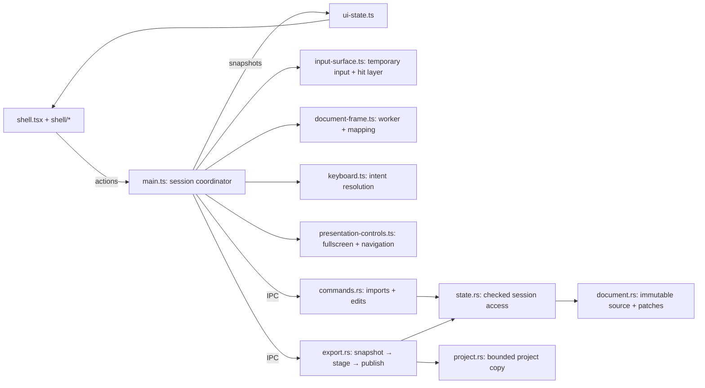

# Simplification contract

- `contracts.ts` remains the IPC data shape. Command names and capabilities stay
  compatible. Rust remains the session/revision authority.
- The frontend entry composes document lifecycle, input and presentation modules.
  Input owns its temporary DOM and focus; shell components only consume state and
  actions. Preserve UTF-8 patching, composition guards and sandbox restrictions.
- Native commands share checked session access. Export validates the revision
  both before preparing data and while publishing, never holding a lock across a
  dialog await. Staged imports replace the active session only after registration.
- Release helpers collect installed npm/Cargo notices and SHA-256 inventories.
  Platform scripts retain source-SHA, no-overwrite, architecture and signature
  validation and their existing output names and metadata.
- No dependencies, tool versions, data limits, visible features or support claims
  change. Failures retain the current recovery and dirty-state semantics.

Explicit modules are preferred over a general service container or command bus:
the latter would hide dependencies and replace local duplication with indirection.

## Code map

`main.rs` composes the native application; `desktop.rs` owns window/menu events;
`dialogs.rs` owns file pickers. `resources.rs` continues to enforce resource scope.
The two platform packaging entry points share `release-common.mjs` for notices
and inventories, retaining their separate platform validation.
